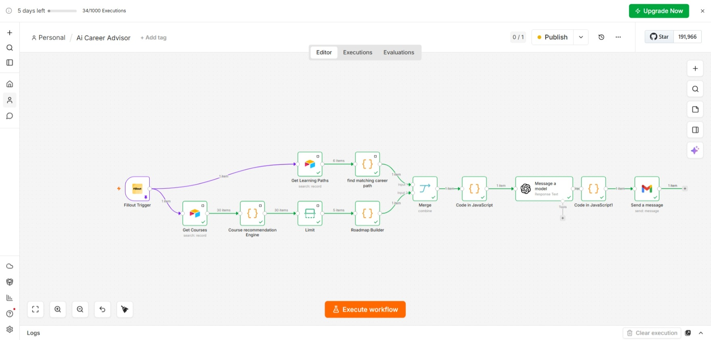
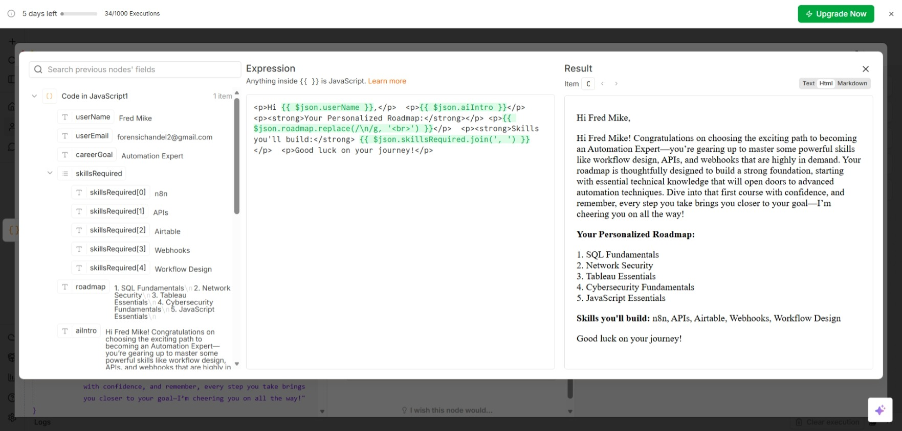
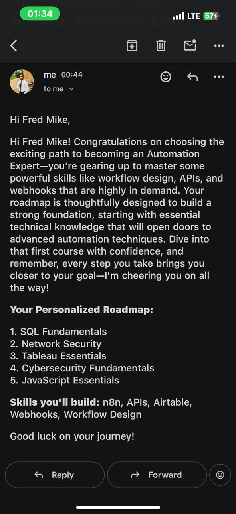

# AI Career Advisor

An AI-powered automation built with n8n that helps users discover personalized career learning roadmaps.

## How It Works

1. A user submits their career interests and skill level via a Fillout form
2. AI matches their input to a relevant career path stored in Airtable
3. AI scores and recommends courses based on their career goal
4. AI generates a short, personalized motivational message
5. The user receives a custom learning roadmap via email

## Tech Stack

- **n8n** – workflow automation
- **OpenAI** – AI classification & content generation
- **Airtable** – database for career paths and courses
- **Fillout** – form intake
- **Gmail** – email delivery

## Workflow Overview

The workflow combines two branches:
- **Learning Path branch**: matches the user's career goal to required skills
- **Course Recommendation branch**: scores and ranks relevant courses into a roadmap

These are merged, enriched with an AI-generated personalized message, and sent to the user via email.

## Setup

1. Import `workflow.json` into your n8n instance
2. Connect your own credentials for: Fillout, Airtable, OpenAI, and Gmail
3. Update the Airtable base/table IDs to match your own bases
4. Activate the workflow

## Note

This is a demo/portfolio version. Sensitive data (API keys, real user data) has been removed.

## Author

Built by Emmanuel Obidigbo — Pharmacist & AI Automation Specialist

## Screenshots

### Workflow Canvas

### Sample Email Output

