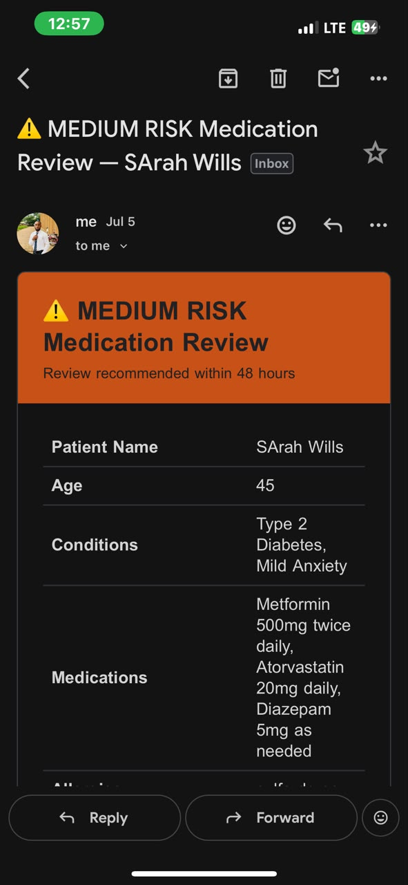
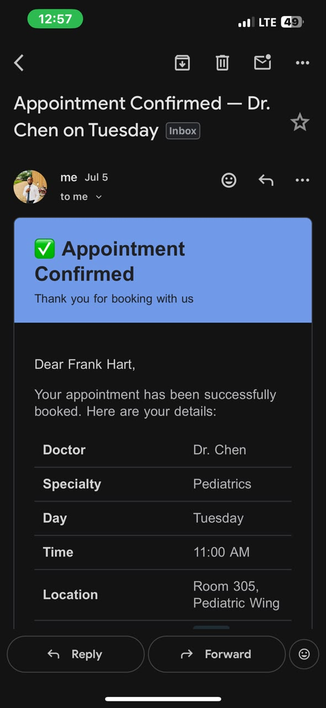
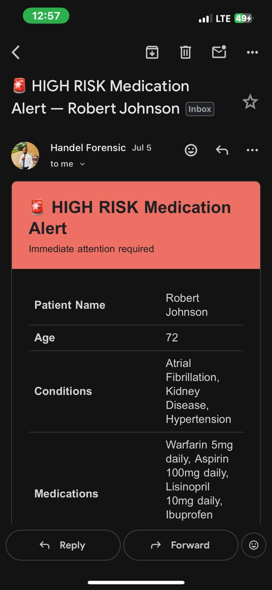
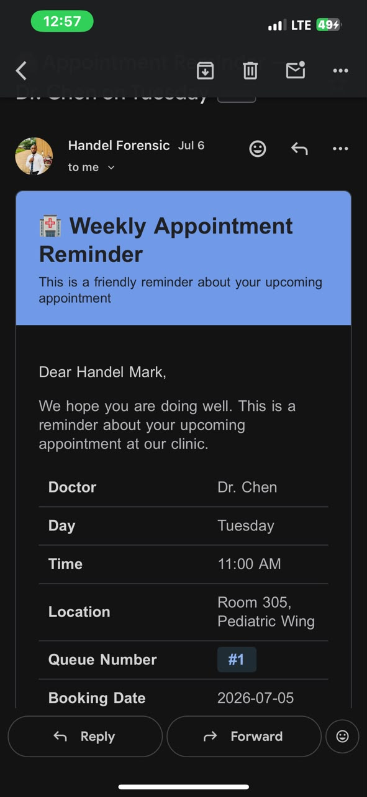

# AI Clinic Assistant

A complete AI-powered clinic management system built with n8n, consisting of 3 interconnected workflows that handle patient bookings, medication safety reviews, and weekly follow-up reminders.

## Workflows

### 1. Appointment Booking
An AI chatbot that guides patients through booking clinic appointments conversationally.

### 2. Medication Review
AI-powered drug interaction checker that screens patient medication profiles and alerts clinical staff.

### 3. Weekly Patient Reminders
Automated weekly email reminders sent to all patients with upcoming booked appointments.

## How It Works

**Appointment Booking:**
1. Patient chats with MedAssist AI via n8n chat interface
2. AI answers general clinic questions by searching Clinic Info table
3. AI guides patient through selecting a doctor, day, and time slot
4. AI checks availability in real-time against the Appointments table
5. AI creates the booking, assigns a queue number, and sends a confirmation email

**Medication Review:**
1. Patient submits medication profile via Fillout form
2. AI analyzes drug-drug interactions and contraindications
3. Classifies risk as HIGH, MEDIUM, or LOW
4. Logs full review to Airtable Patient Reviews table
5. HIGH/MEDIUM risk alerts pharmacist/doctor via email
6. LOW risk sends reassurance email directly to patient

**Weekly Reminders:**
1. Runs every Monday at 8:00 AM automatically
2. Fetches all booked appointments from Airtable
3. Sends personalized reminder email to each patient with appointment details and queue number

## Tech Stack

- **n8n** – workflow automation
- **OpenAI (GPT-4.1-mini)** – AI chat agent and medication analysis
- **Airtable** – clinic database (Doctors, Appointments, Clinic Info, Patient Reviews)
- **Fillout** – patient medication intake form
- **Gmail** – confirmation emails, risk alerts, weekly reminders

## Airtable Setup

Create a base called **"Clinic System"** with 4 tables:

**Doctor Schedule:** Doctor Name, Specialty, Day, Clinic Room/Location, Time Slot

**Appointments:** Patient Name, Patient Email, Doctor, Day, Time Slot, Location, Queue Number, Status, Booking Date

**Clinic Info:** Topic, Answer

**Patient Reviews:** Patient Name, Patient Email, Age, Conditions, Medications, Allergies, Risk Level, Interactions Found, Contraindications, Recommendations, Clinical Summary, Review Date

## Setup Instructions

1. Import all 3 workflow JSON files into your n8n instance
2. Connect credentials: OpenAI, Airtable, Fillout, Gmail
3. Update all Airtable base/table IDs with your own
4. Update pharmacist email address in Medication Review workflow
5. Populate your Airtable tables using the provided CSV sample data
6. Activate all 3 workflows

## Note

This is a demo/portfolio version. All sensitive data (API keys, real patient data, credential IDs) has been removed and replaced with placeholders.

## Author

Built by Emmanuel Obidigbo — Pharmacist & AI Automation Specialist

## Screenshots

### Medium Risk Medication Review

### Booking Confirmation Email

### High Risk Medication Review Alert Email

### Weekly Reminder Email

### Workflow Canvas

