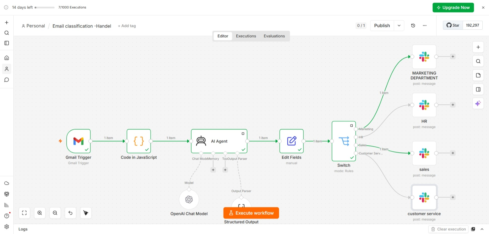
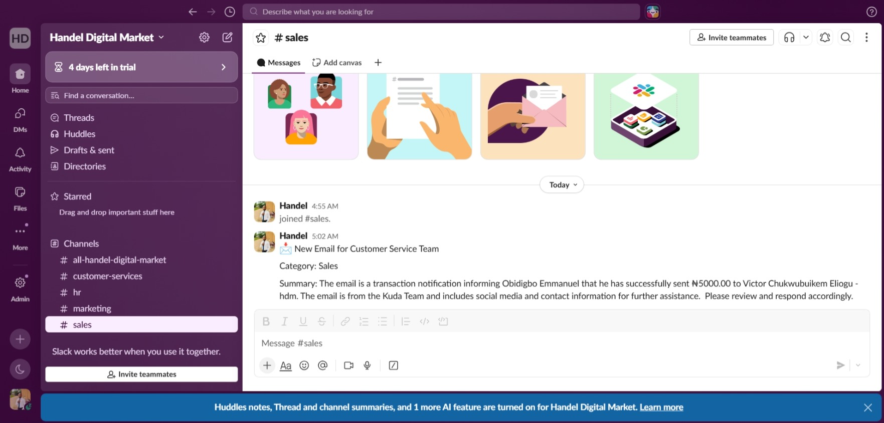

# Email Classification & Department Router

An AI-powered automation built with n8n that monitors a Gmail inbox, classifies incoming emails by department, and routes summaries to the right Slack channel.

## How It Works

1. Gmail Trigger polls the inbox for new emails every minute
2. A keyword-based pre-check tags the email with an initial category
3. An AI Agent (GPT-4o-mini) reads the email subject and body, classifies it into one of: **Sales**, **Marketing**, **HR**, or **Customer Service**, and generates a short summary
4. A Switch node routes the email based on its AI-assigned category
5. A Slack message is sent to the relevant department channel with the category and summary

## Tech Stack

- **n8n** – workflow automation
- **Gmail** – inbox monitoring (trigger)
- **OpenAI (GPT-4o-mini)** – email classification & summarization
- **Slack** – department notifications

## Setup

1. Import `workflow.json` into your n8n instance
2. Connect your own credentials for: Gmail, OpenAI, and Slack
3. Update the Slack channel IDs for each department (Marketing, HR, Sales, Customer Service)
4. Activate the workflow

## Note

This is a demo/portfolio version. Sensitive data (API keys, channel IDs) has been removed.

## Screenshots

### Workflow Canvas

### Slack Notification Example

## Author

Built by Emmanuel Obidigbo — Pharmacist & AI Automation Specialist
