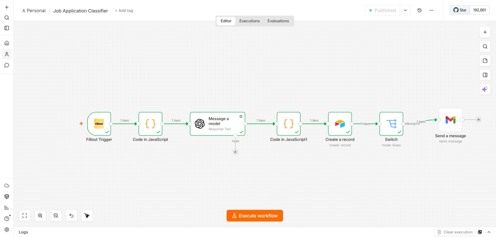
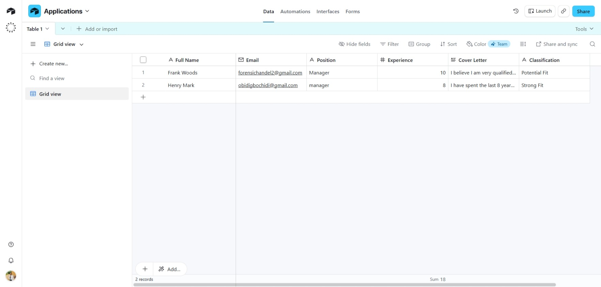
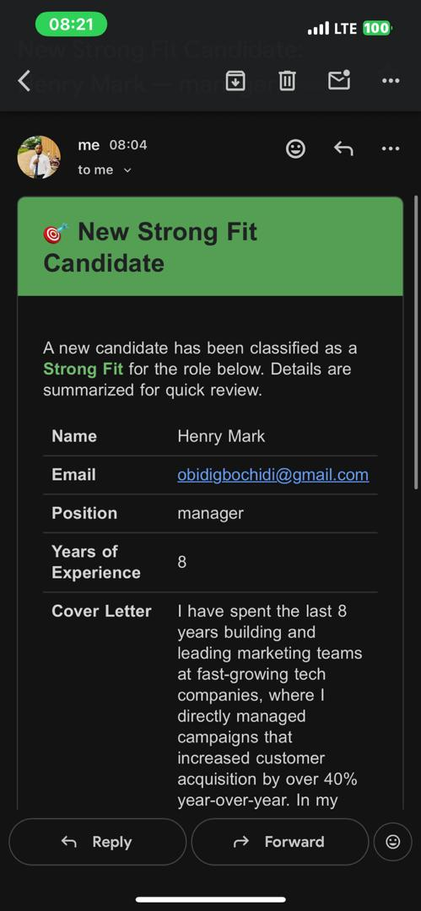

# Job Application Classifier

An AI-powered automation built with n8n that screens job applications and instantly notifies HR about strong-fit candidates.

## How It Works

1. A candidate submits an application via a Fillout form (name, email, position, experience, cover letter)
2. AI evaluates the application and classifies it as **Strong Fit**, **Potential Fit**, or **Not a Fit**
3. The application and its classification are logged in Airtable
4. If classified as **Strong Fit**, an HTML email notification is sent to HR with the candidate's full details

## Tech Stack

- **n8n** – workflow automation
- **OpenAI** – AI-based application screening
- **Airtable** – application database
- **Fillout** – application form intake
- **Gmail** – HR notifications

## Setup

1. Import `workflow.json` into your n8n instance
2. Connect your own credentials for: Fillout, Airtable, OpenAI, and Gmail
3. Update the Airtable base/table IDs to match your own base
4. Update the notification email address in the "Send a message" node
5. Activate the workflow

## Note

This is a demo/portfolio version. Sensitive data (API keys, real candidate data) has been removed.

## Screenshots

### Workflow Canvas

### AI Classification Output

### Strong Fit Email Notification

## Author

Built by Obidigbo Emmanuel — Pharmacist & AI Automation Specialist
