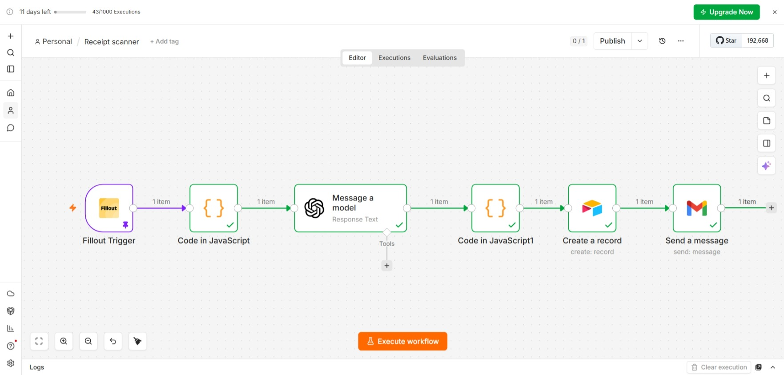
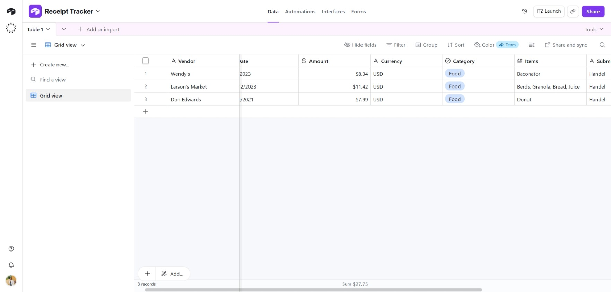
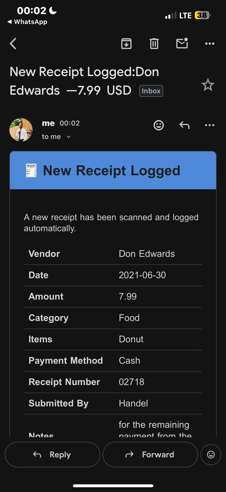

# AI Receipt & Invoice Scanner

An AI-powered automation built with n8n that scans uploaded receipt images, extracts key data automatically, logs everything to Airtable, and sends an email notification.

## How It Works

1. A user submits a receipt/invoice image via a Fillout form (name, image upload, notes)
2. A Code node extracts the image URL and form fields
3. OpenAI Vision (GPT-4.1-mini) reads the receipt image and extracts structured data including vendor, date, amount, currency, category, items, payment method, and receipt number
4. A second Code node parses the AI response into clean fields
5. The extracted data is logged as a new record in Airtable
6. An HTML email notification is sent with the full receipt summary

## Tech Stack

- **n8n** – workflow automation
- **OpenAI (GPT-4.1-mini)** – AI vision/OCR for receipt data extraction
- **Airtable** – expense tracking database
- **Fillout** – receipt image upload form
- **Gmail** – email notification

## Airtable Fields Required

Create a table with these fields:
- Vendor (Single line text)
- Date (Date)
- Amount (Number)
- Currency (Single line text)
- Category (Single select: Food, Travel, Office Supply, Utilities, Entertainment, Medical, Shopping, Other)
- Items (Long text)
- Submitted By (Single line text)
- Receipt Image (Attachment)

## Setup

1. Import `workflow.json` into your n8n instance
2. Connect your own credentials for: Fillout, Airtable, OpenAI, and Gmail
3. Update the Airtable base/table IDs to match your own base
4. Update the recipient email address in the "Send a message" node
5. Activate the workflow

## Note

This is a demo/portfolio version. Sensitive data (API keys, real receipt data) has been removed.

## Author

Built by Emmanuel Obidigbo — Pharmacist & AI Automation Specialist

## Screenshots

### Workflow Canvas

### Airtable Logs 

### Receipt Email Notification

